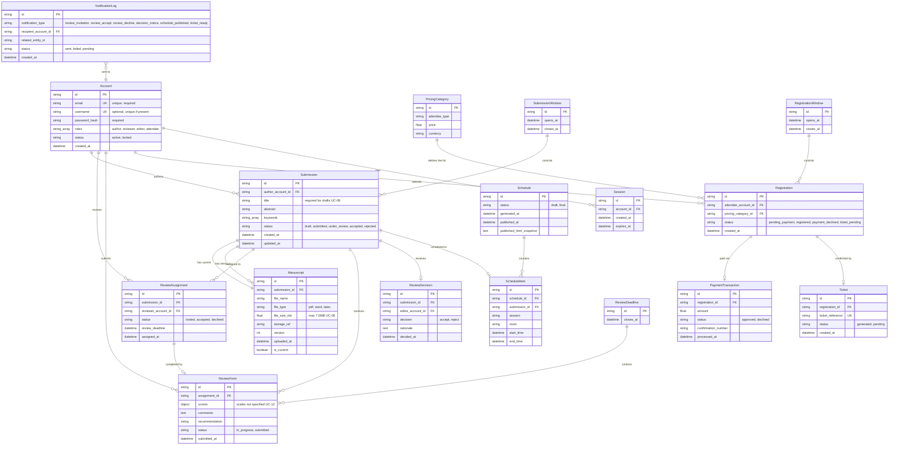

# CMS Entity-Relationship Diagram

**Date**: February 6, 2026  
**Source**: Combined from data-model.md - Complete data model for all 23 use cases  
**Entities**: 15 total (12 core + 3 configuration)  
**Functional Requirements**: Supports FR-001 through FR-032

## Diagram



## Entity Summary

**Core Entities (12)**:
1. **Account** - User identities with roles (author, reviewer, editor, attendee) | FR-001 to FR-010
2. **Session** - Authenticated user sessions | FR-005, FR-008
3. **Submission** - Paper submissions with metadata | FR-011, FR-014, FR-015
4. **Manuscript** - Uploaded paper files with versioning | FR-013, FR-018
5. **ReviewAssignment** - Paper-to-reviewer mappings (exactly 3 per paper) | FR-019, FR-020
6. **ReviewForm** - Reviewer evaluations | FR-022, FR-023, FR-024
7. **ReviewDecision** - Final accept/reject outcomes | FR-025
8. **Schedule** - Conference schedule versions | FR-027, FR-029
9. **ScheduleItem** - Individual paper placements | FR-028
10. **PricingCategory** - Attendee types and fees | FR-030
11. **Registration** - Conference registrations | FR-031
12. **PaymentTransaction** - Payment processing records | FR-031
13. **Ticket** - Registration confirmations | FR-032
14. **NotificationLog** - Email/dashboard notification tracking | FR-026, NFR-003

**Configuration Entities (3)**:
15. **SubmissionWindow** - Submission period constraints | FR-017
16. **ReviewDeadline** - Review period constraints | FR-022, FR-023
17. **RegistrationWindow** - Registration period constraints | Referenced in UC-21

## Key Relationships & Cardinality Constraints

### Authentication & Authorization
- Account 1:N Session (one user, multiple sessions)
- Account has roles array → enables role-based dashboard (FR-005)

### Paper Submission Lifecycle
- Account 1:N Submission (author → papers)
- Submission 1:1 Manuscript (current version)
- Submission 1:N Manuscript (all versions) → preserves history (FR-018)
- Submission status: draft → submitted → under_review → accepted/rejected

### Review Process
- Submission 1:3 ReviewAssignment (exactly 3 reviewers) → enforces FR-019
- Account (reviewer) max 5 ReviewAssignments (workload limit) → enforces FR-019
- ReviewAssignment 1:0..1 ReviewForm (completion optional until accepted)
- ReviewAssignment status: invited → accepted/declined → enforces FR-020
- Submission 1:0..1 ReviewDecision (decision only after 3 reviews) → enforces FR-024, FR-025

### Scheduling
- Schedule 1:N ScheduleItem (schedule contains entries)
- ScheduleItem N:1 Submission (paper placement)
- Schedule status: draft → final → enforces FR-029

### Conference Registration
- Account 1:N Registration (attendee → registrations)
- Registration N:1 PricingCategory (category selection) → enforces FR-030
- Registration 1:0..1 PaymentTransaction (payment required) → enforces FR-031
- Registration 1:0..1 Ticket (confirmation after payment) → enforces FR-032
- Ticket status: generated | pending (delayed generation allowed) → enforces FR-032

### Notifications
- NotificationLog N:1 Account (recipient tracking)
- Notification status: sent | failed | pending → enforces NFR-003 safe failure

## Validation & Business Rules (Derived From Use Cases)

### Account Management (UC-01 to UC-05)
- **FR-002**: Email format and uniqueness validated at registration
- **FR-003**: Password validation per UC-02 and UC-04 acceptance tests (specific rules not specified)
- Login supports email OR username (UC-03 email; UC-05 email/username)
- Authorized user = registered + authenticated + correct role

### Paper Submission (UC-06 to UC-09)
- **FR-012**: Required metadata: title, abstract, keywords, author names, affiliation/contact
- **FR-013**: Manuscript file types: PDF, Word, LaTeX only
- **FR-013**: Manuscript size: ≤ 7.0MB (exactly 7.0MB accepted)
- **FR-014**: Draft save requires minimum: at least title/identifier
- **FR-017**: Draft viewing allowed after deadline; submission blocked
- **FR-018**: Manuscript replacement preserves prior version on failure

### Review Process (UC-10 to UC-17)
- **FR-019**: Exactly 3 reviewers per submission
- **FR-019**: Reviewer workload ≤ 5 active assignments
- **FR-020**: Review form access only after acceptance
- **FR-022**: Review deadline restricts both access and submission
- **FR-023**: Review form requires: ratings/scores, comments, recommendation (scales not specified)
- **FR-024**: Reviews Complete status only after exactly 3 reviews submitted
- **FR-025**: Editor decision only after 3 completed reviews
- **FR-026**: Notification failure does not block decision storage

### Scheduling (UC-18 to UC-20)
- **FR-027**: Schedule generation requires accepted papers
- **FR-028**: Schedule edit validation prevents room/time conflicts
- **FR-029**: Published schedules are publicly accessible
- **FR-029**: Schedule notifications optional; publication success independent

### Registration & Payment (UC-21 to UC-23)
- **FR-030**: Pricing display requires preconfigured categories
- **FR-031**: Registration confirmed only on payment approval
- **FR-031**: Payment declined → registration remains incomplete
- **FR-032**: Ticket generation failure delays ticket but preserves registration

## State Transitions (Key Workflows)

### Submission Lifecycle
```
Draft → Submitted (UC-06 final submission)
Submitted → Under Review (UC-10 reviewer assignment)
Under Review → Accepted | Rejected (UC-16 editor decision)
```

### Review Assignment Lifecycle
```
Invited → Accepted (UC-13 reviewer accepts)
Invited → Declined (UC-13 reviewer declines)
```

### Review Form Lifecycle
```
In Progress → Submitted (UC-14 within deadline)
```

### Schedule Lifecycle
```
Draft → Final (UC-20 after publish confirmation)
```

### Registration Lifecycle
```
Pending Payment → Registered (UC-21 payment approved)
Pending Payment → Payment Declined (UC-21 payment declined)
Registered → Ticket Pending (UC-22 ticket generation fails)
```

### Ticket Lifecycle
```
Pending → Generated (UC-22 retry succeeds)
```

## Traceability to Functional Requirements

| Entity | Supports FRs | Use Cases |
|--------|-------------|-----------|
| Account | FR-001 to FR-010 | UC-01 to UC-05 |
| Session | FR-005, FR-008 | UC-03, UC-05 |
| Submission | FR-011, FR-012, FR-014 to FR-017 | UC-06 to UC-09 |
| Manuscript | FR-013, FR-018 | UC-06, UC-07, UC-08 |
| ReviewAssignment | FR-019 to FR-021 | UC-10, UC-11, UC-13 |
| ReviewForm | FR-022 to FR-024 | UC-12, UC-14, UC-15 |
| ReviewDecision | FR-025 | UC-16 |
| Schedule | FR-027, FR-029 | UC-18, UC-20 |
| ScheduleItem | FR-028 | UC-19 |
| PricingCategory | FR-030 | UC-23 |
| Registration | FR-031 | UC-21 |
| PaymentTransaction | FR-031 | UC-21 |
| Ticket | FR-032 | UC-22 |
| NotificationLog | FR-026, NFR-003 | UC-17, UC-20 |

## Non-Functional Requirements Support

- **NFR-001**: Account.roles enables authorization checks; sensitive fields (password_hash, payment data) not exposed in API responses
- **NFR-002**: Error messages defined in contracts avoid credential/payment detail exposure
- **NFR-003**: NotificationLog.status tracks failures; core state changes persist despite external service failures

## Viewing Instructions

To view this diagram in VS Code:
1. Install the "Markdown Preview Mermaid Support" extension if not already installed
2. Open this file and press Ctrl+Shift+V (or Cmd+Shift+V on Mac) to preview
3. The diagram will render visually in the preview pane

Alternatively, view at https://mermaid.live by copying the diagram code.

## Change Log

- **2026-02-06**: Combined with data-model.md; added Session entity; added NotificationLog entity; renamed Review → ReviewForm, Decision → ReviewDecision for clarity; added field descriptions and FR references; added business rules and state transitions; added traceability table.
- **2026-02-05**: Initial ERD created with 11 core + 3 configuration entities.
