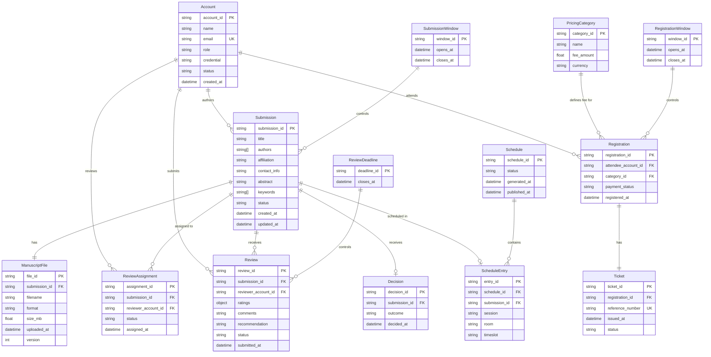

# CMS Entity-Relationship Diagram

**Date**: February 5, 2026  
**Source**: Complete data model for all 23 use cases  
**Entities**: 14 total (11 core + 3 configuration)

## Diagram

## Entity Summary

**Core Entities (11)**:
1. Account - User identities (author, reviewer, editor, attendee)
2. Submission - Paper submissions with metadata
3. ManuscriptFile - Uploaded paper files
4. ReviewAssignment - Paper-to-reviewer mappings
5. Review - Reviewer evaluations
6. Decision - Final accept/reject outcomes
7. Schedule - Conference schedule versions
8. ScheduleEntry - Individual paper placements
9. PricingCategory - Attendee types and fees
10. Registration - Conference registrations
11. Ticket - Registration confirmations

**Configuration Entities (3)**:
12. SubmissionWindow - Submission period constraints
13. ReviewDeadline - Review period constraints
14. RegistrationWindow - Registration period constraints

## Key Relationships

- Account authors multiple Submissions (1:N)
- Submission has one ManuscriptFile (1:1)
- Submission receives multiple ReviewAssignments (1:N)
- Submission receives multiple Reviews (1:N)
- Submission receives one Decision after reviews complete (1:0..1)
- Schedule contains multiple ScheduleEntries (1:N)
- Account attends via multiple Registrations (1:N)
- Registration has one Ticket (1:1)

## State Transitions

- Submission: Draft → Submitted
- ReviewAssignment: Invited → Accepted | Declined
- Review: In Progress → Submitted
- Schedule: Draft → Final
- Registration: Pending → Approved | Declined
- Ticket: Generated | Delayed

## Viewing Instructions

To view this diagram in VS Code:
1. Install the "Markdown Preview Mermaid Support" extension if not already installed
2. Open this file and press Ctrl+Shift+V (or Cmd+Shift+V on Mac) to preview
3. The diagram will render visually in the preview pane

Alternatively, view at https://mermaid.live by copying the diagram code.
